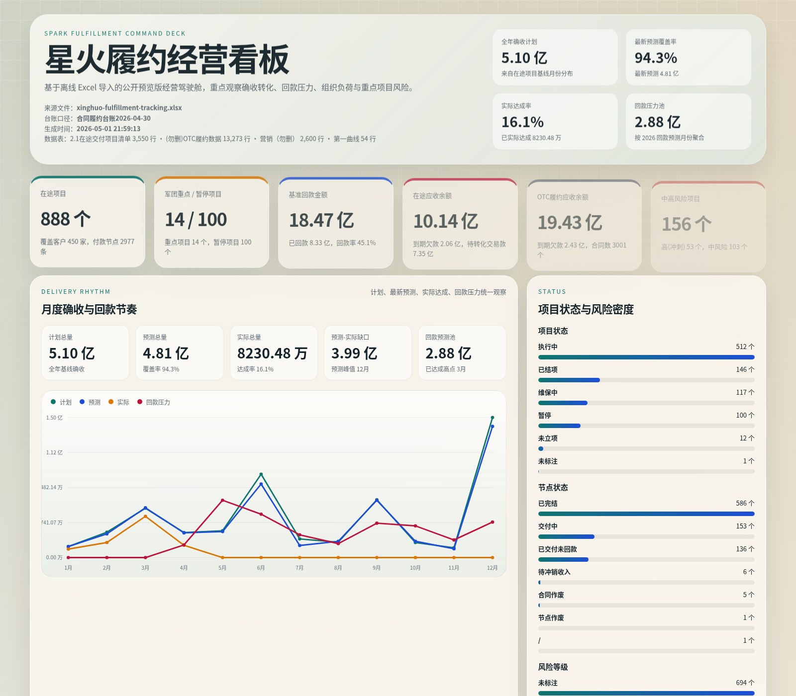
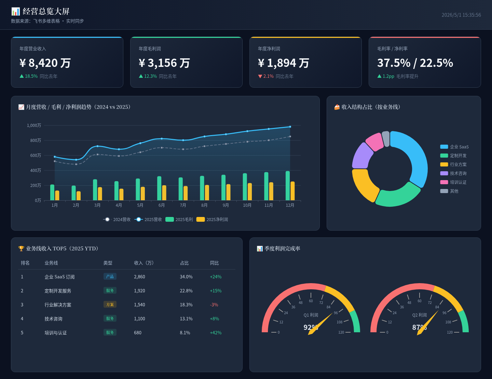
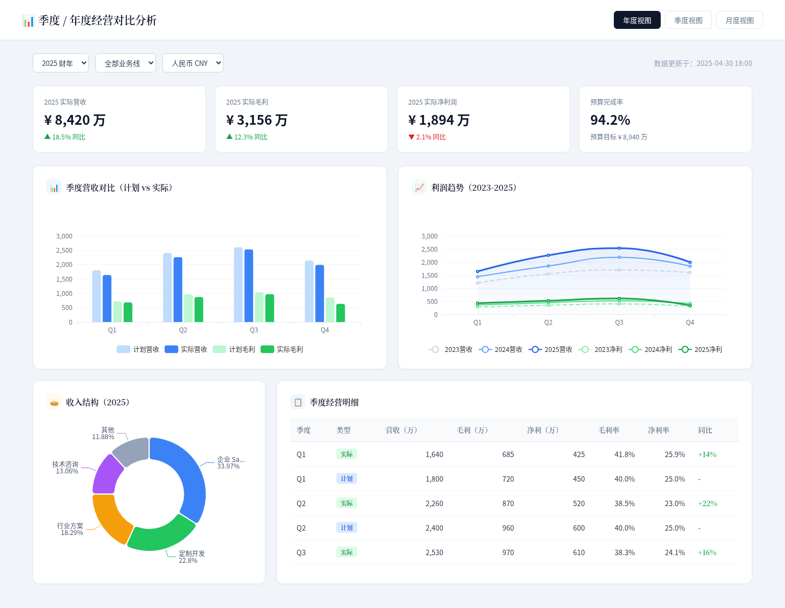
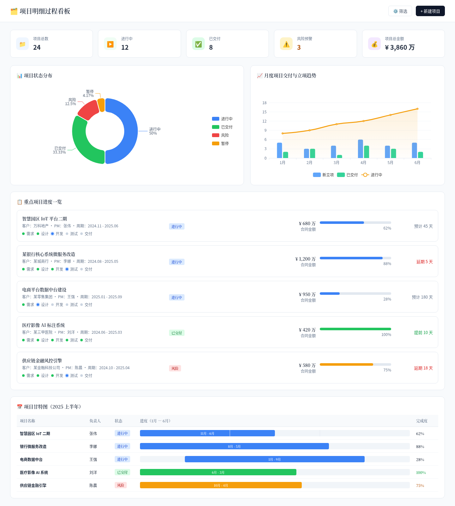
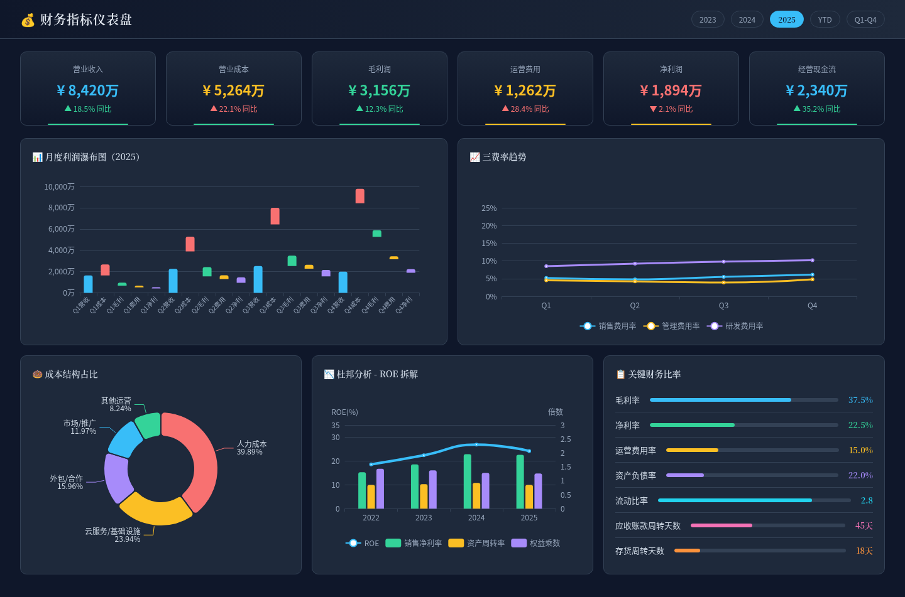

# Dashboard Demos

经营数据可视化 Demo 仓库，包含静态经营分析页面、基于 mock 飞书表格数据的经营看板原型，以及一套基于真实离线履约台账导入生成的公开预览版经营看板。

## 在线访问

- GitHub Pages 首页：
  `https://phiclin-pixel.github.io/dashboard-demos/`
- 飞书经营看板 Demo：
  `https://phiclin-pixel.github.io/dashboard-demos/feishu-live-demo/static/index.html`
- 星火履约经营看板：
  `https://phiclin-pixel.github.io/dashboard-demos/spark-fulfillment-dashboard/`
- 经营总览大屏：
  `https://phiclin-pixel.github.io/dashboard-demos/dashboard-1-overview.html`
- 季度 / 年度对比分析：
  `https://phiclin-pixel.github.io/dashboard-demos/dashboard-2-quarterly.html`
- 项目过程看板：
  `https://phiclin-pixel.github.io/dashboard-demos/dashboard-3-projects.html`
- 财务指标仪表盘：
  `https://phiclin-pixel.github.io/dashboard-demos/dashboard-4-financial.html`

## 预览图

### 星火履约经营看板



### 飞书经营看板 Demo


### 其他静态看板

- 经营总览大屏
  
- 季度 / 年度对比分析
  
- 项目过程看板
  
- 财务指标仪表盘
  

## 仓库内容

- `index.html`
  GitHub Pages 首页，汇总所有 demo 入口。
- `dashboard-1-overview.html`
  经营总览大屏。
- `dashboard-2-quarterly.html`
  季度 / 年度对比分析。
- `dashboard-3-projects.html`
  项目过程看板。
- `dashboard-4-financial.html`
  财务指标仪表盘。
- `feishu-live-demo/`
  飞书经营看板原型，包含 mock 表格数据、前端页面、静态预览快照和本地实时服务。
- `spark-fulfillment-dashboard/`
  基于真实离线履约 Excel 导入生成的公开预览版经营看板，包含导入脚本、脱敏后的 JSON 数据和可直接发布的静态页面。
- `preview-spark-fulfillment.png`
  星火履约经营看板在线预览截图。

## 飞书经营看板原型说明

这个 Demo 验证的是一条最小闭环：

`飞书普通表格 / 多维表格 -> 聚合中间层 -> 经营看板`

当前支持两种运行形态：

1. GitHub Pages 静态预览
   适合直接在线查看页面效果，页面基于静态快照渲染。
2. 本地 Python 实时版
   适合验证聚合接口、SSE 推送和模拟数据变更。

详细说明见：

- [feishu-live-demo/README.md](./feishu-live-demo/README.md)

## 星火履约经营看板说明

这个 Demo 验证的是另一条链路：

`离线 Excel / NAS 文件 -> 清洗脱敏脚本 -> 静态经营看板 -> GitHub Pages`

详细说明见：

- [spark-fulfillment-dashboard/README.md](./spark-fulfillment-dashboard/README.md)

## 本地运行实时版

```bash
cd feishu-live-demo
python3 server.py --port 8765
```

访问：

- `http://127.0.0.1:8765/`

## 当前发布状态

- 仓库已发布到 GitHub。
- GitHub Pages 首页可访问。
- 飞书经营看板 Demo 页面可访问。
- 星火履约经营看板页面可访问。
- Demo 的 CSS、JS 和 mock 数据资源已验证可正常加载。

## 接真实飞书时建议继续补的部分

1. 飞书开放平台认证与 API 适配层。
2. 统一字段映射和指标口径配置。
3. 增量同步、Webhook 和权限控制。
4. 看板权限、多视图和角色分层。
