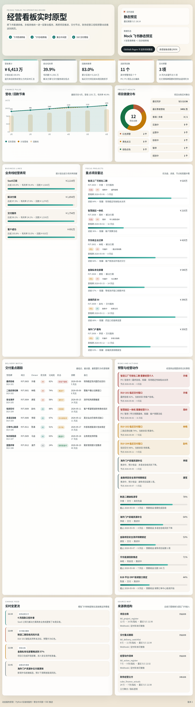

# 飞书经营看板实时原型

一个用于演示“飞书表格驱动经营看板”的最小可行原型。

目标链路：

`飞书普通表格 / 多维表格 -> 聚合中间层 -> 经营看板`

当前版本先用 mock 数据把结构、页面和运行方式打通，方便后续替换为真实飞书 API。

## 在线预览

- GitHub Pages 页面：
  `https://phiclin-pixel.github.io/dashboard-demos/feishu-live-demo/static/index.html`
- 原始 mock 表格数据：
  `https://phiclin-pixel.github.io/dashboard-demos/feishu-live-demo/data/mock_feishu_tables.json`

在线版说明：

- 页面运行在 GitHub Pages 上。
- 使用静态快照展示，不依赖 Python 服务。
- 页面会自动切换到“静态预览”模式。

## 预览图



## 本地实时版

```bash
cd /home/phiclin/dashboard-demos/feishu-live-demo
python3 server.py --port 8765
```

启动后访问：

- `http://127.0.0.1:8765/`

本地模式下可用接口：

- `GET /api/dashboard`
  聚合后的经营看板数据。
- `GET /api/tables`
  原始 mock 表格数据。
- `POST /api/mutate`
  手动模拟一次表格变更。
- `GET /events`
  SSE 实时事件流。

## 当前覆盖的数据域

- 项目台账
- 交付重点跟踪
- 经营动作清单
- 财务经营立方

对应页面上展示为：

- KPI 汇总
- 月度营收 / 回款趋势
- 项目健康分布
- 业务线经营表现
- 重点项目列表
- 交付里程碑跟踪
- 经营预警与动作清单
- 实时变更流

## 目录结构

- `data/mock_feishu_tables.json`
  模拟飞书普通表格和多维表格原始数据。
- `server.py`
  Python 标准库实现的轻量服务，负责读表、聚合、SSE 推送和模拟更新。
- `static/index.html`
  Demo 页面入口。
- `static/app.js`
  前端渲染逻辑，支持在线静态预览和本地实时模式两种运行方式。
- `static/styles.css`
  页面样式。
- `static/mock-dashboard.json`
  GitHub Pages 使用的静态聚合快照。

## 运行模式

### 1. GitHub Pages 静态预览

适合直接展示页面效果：

- 不依赖后端服务。
- 使用静态快照渲染。
- 可以在线查看原始 mock 数据。

### 2. 本地 Python 实时版

适合验证服务端聚合与推送机制：

- 提供 `/api/dashboard`
- 提供 `/api/tables`
- 提供 `/api/mutate`
- 提供 `/events`

## 这个原型验证了什么

1. 多张来源表可以先统一成标准实体层，而不是让前端直接耦合飞书 API。
2. 财务、项目、交付、经营动作可以在中间层做二次聚合和统一告警。
3. 看板既可以做成静态在线预览，也可以做成带实时推送的动态网页服务。
4. 真实接入飞书时，替换数据接入层即可，不需要重写看板页面。

## 接真实飞书时建议的四层结构

1. `Feishu Adapter`
   负责认证、分页、限流和读取飞书普通表格 / 多维表格。
2. `Normalization Layer`
   负责把不同表结构映射为项目、交付、财务、动作等标准实体。
3. `Aggregation / Rules Layer`
   负责 KPI 口径、预警规则、重点排序、趋势分析和经营动作闭环。
4. `Dashboard Delivery Layer`
   负责对前端输出 JSON、SSE 或 WebSocket。

## 后续可以继续补的部分

1. 接真实飞书开放平台 API。
2. 把指标口径和预警规则做成配置化。
3. 增加权限控制、多看板视图和登录能力。
