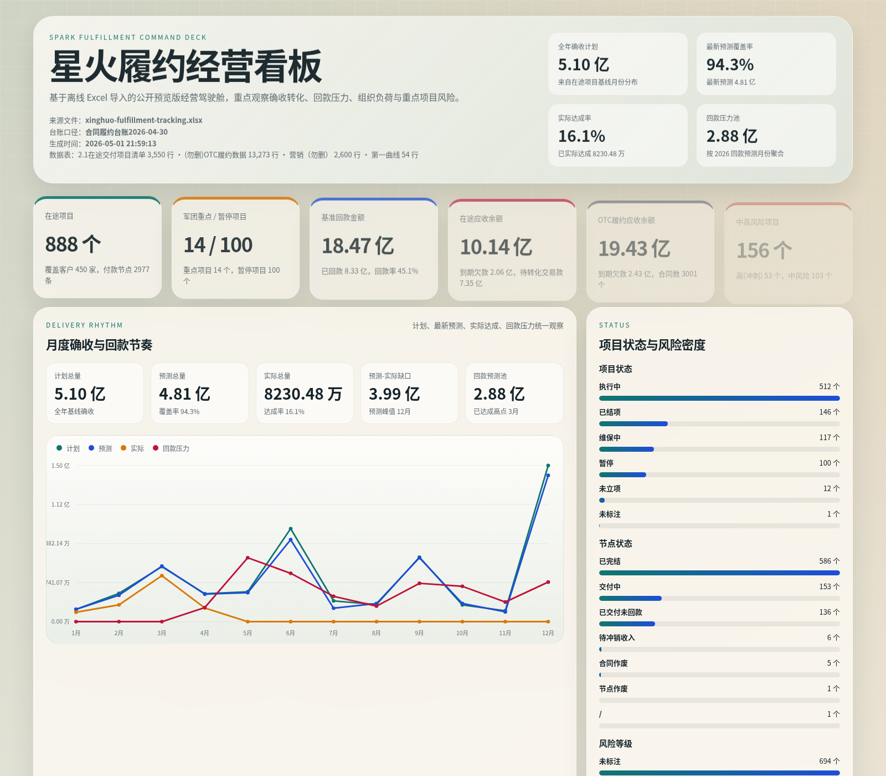

# 星火履约经营看板

基于用户提供的离线履约台账 Excel 生成的一套静态经营看板。页面适合直接发布到 GitHub Pages，展示层不依赖后端，数据更新通过重新执行导入脚本完成。



## 页面覆盖

- 在途项目概览：项目数、客户数、重点项目、暂停项目、确收与回款总盘
- 月度节奏：基线确收、最新预测、实际达成、回款压力的全年分布
- 组织结构：业务单元、交付部门、客群、产品家族
- 应收风险：OTC 账龄、回款目标纳管、履约类型、逾期合同
- 营销牵引：营销板块与团队的全年基线、预测、实际、回款
- 重点跟踪：脱敏后的重点项目与高风险逾期合同

## 数据来源

- NAS 文件：`smb://192.168.1.188/public/file/星火履约跟进表—日常跟进.xlsx`
- 导入脚本：[scripts/build_data.py](./scripts/build_data.py)
- 生成数据：[data/dashboard-data.json](./data/dashboard-data.json)

当前脚本读取并聚合这些工作表：

- `2.1在途交付项目清单`
- `(勿删)OTC履约数据`
- `营销（勿删）`
- `第一曲线`

## 处理链路

1. 从 NAS 取回源 Excel
2. 用 [scripts/build_data.py](./scripts/build_data.py) 直接解析 `xlsx` 包内 XML
3. 对在途项目、OTC、营销汇总做字段清洗、口径统一与脱敏
4. 生成公开页面使用的 [data/dashboard-data.json](./data/dashboard-data.json)
5. 静态页面 [index.html](./index.html) 读取 JSON 渲染看板

## 项目结构

```text
spark-fulfillment-dashboard/
├── app.js
├── index.html
├── styles.css
├── assets/
│   └── preview-top.png
├── data/
│   └── dashboard-data.json
└── scripts/
    └── build_data.py
```

## 脱敏策略

该仓库面向公开在线预览，导出 JSON 时做了以下处理：

- 不发布原始 Excel 文件
- 重点项目只保留脱敏项目标识、客户掩码与经营指标
- 逾期合同只保留脱敏合同标识、客户掩码与应收风险指标
- 不公开项目长文本进展、风险描述、负责人实名等内部信息

## 本地预览

```bash
cd /home/phiclin/spark-fulfillment-dashboard
python3 -m http.server 8891
```

打开 `http://127.0.0.1:8891/`。

## 刷新数据

如果 NAS 上的 Excel 更新了，重新执行：

```bash
python3 /home/phiclin/spark-fulfillment-dashboard/scripts/build_data.py \
  --source /path/to/source.xlsx \
  --output /home/phiclin/spark-fulfillment-dashboard/data/dashboard-data.json
```

脚本会重新生成 `data/dashboard-data.json`，页面刷新后即可看到最新结果。

默认参数仍然指向当前机器上的源文件位置：

- `/home/phiclin/dashboard-imports/xinghuo-fulfillment-tracking.xlsx`

## 发布

- 仓库可直接启用 GitHub Pages
- 页面入口为仓库根目录的 `index.html`
- 所有资源均使用相对路径，兼容本地预览和 Pages 子路径访问
